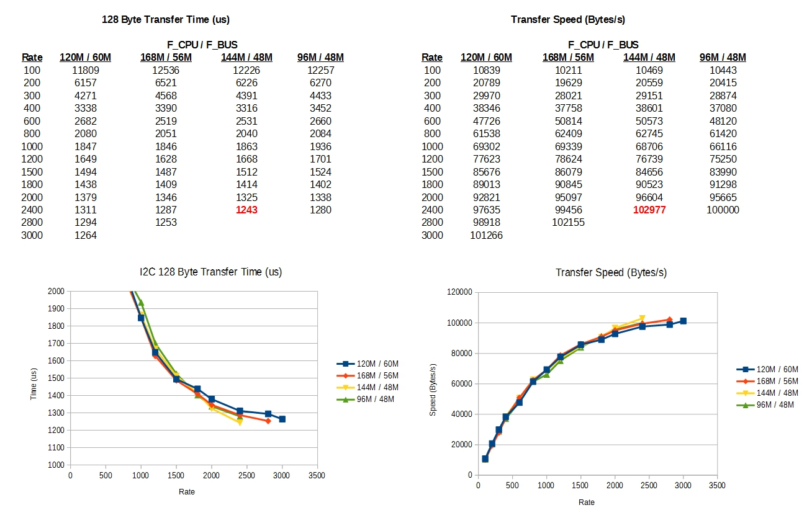

# i2c_t3
Enhanced I2C library for Teensy 3.x & LC devices

This is an enhanced I2C library for [Teensy 3.x/LC devices](http://pjrc.com/teensy/index.html).

Recent discussion and a usage summary can be found in the [PJRC forums here](https://forum.pjrc.com/threads/21680-New-I2C-library-for-Teensy3).

## **Description**

This library is designed to operate from the Arduino/Teensyduino development system.  However this is not strictly required as the files can be used independently.  Recent releases of the library are bundled with the Teensyduino software [available here](http://pjrc.com/teensy/td_download.html).  Follow the instructions on that page for installation.

The library can also be downloaded separately (eg. for updates), and used by unpacking the library contents into your **sketchbook/libraries** folder.  

To use with existing Arduino sketches, simply change the **#include \<Wire.h\>** to **#include \<i2c_t3.h\>**

Example sketches can be found in the Arduino menus at: **File->Examples->i2c_t3**

The latest version of the library provides the following:

* For **Teensy 3.0**, there is one I2C interface: **Wire**
* For **Teensy 3.1, 3.2, LC**, there are two I2C interfaces: **Wire**, **Wire1**
* For **Teensy 3.5**, there are three I2C interfaces: **Wire**, **Wire1**, **Wire2**
* For **Teensy 3.6**, there are four I2C interfaces: **Wire**, **Wire1**, **Wire2**, **Wire3**

## **Pins**

Some interfaces have multiple sets of pins that they can utilize. For a given interface only one set of pins can be used at a time, but for a device configured as a bus Master the pins can be changed on-the-fly when the bus is idle.  

The mapping of device type, available pins, and interfaces is as follows:
```
Interface  Devices     Pin Name      SCL    SDA
---------  -------  --------------  -----  -----
   Wire      All    I2C_PINS_16_17    16     17
   Wire      All    I2C_PINS_18_19    19     18  *
   Wire    3.5/3.6  I2C_PINS_7_8       7      8
   Wire    3.5/3.6  I2C_PINS_33_34    33     34
   Wire    3.5/3.6  I2C_PINS_47_48    47     48
  Wire1       LC    I2C_PINS_22_23    22     23
  Wire1    3.1/3.2  I2C_PINS_26_31    26     31
  Wire1    3.1/3.2  I2C_PINS_29_30    29     30
  Wire1    3.5/3.6  I2C_PINS_37_38    37     38
  Wire2    3.5/3.6  I2C_PINS_3_4       3      4
  Wire3      3.6    I2C_PINS_56_57    57     56  *
```
  
Note: in almost all cases SCL is the lower pin #, except cases marked *

On some devices the pins for the 2nd and higher number buses (Wire1, Wire2, Wire3) may reside on surface mount backside pads. It is recommended to use a breakout expansion board to access those, as the pads are likely not mechanically robust, with respect to soldered wires pulling on them.  There are a number of breakout boards for this purpose such as these:

* Clever slotted board: https://www.oshpark.com/shared_projects/ttl7D5iT
* Full kit board: https://www.tindie.com/products/loglow/teensy-32-breakout/

## **Pullups**

The I2C bus is a two-wire interface where the SDA and SCL are active pulldown and passive pullup (resistor pullup). When the bus is not communicating both line voltages should be at the high level pullup voltage.

The pullup resistor needs to be low-enough resistance to pull the line voltage up given the capacitance of the wire and the transfer speed used. For a given line capacitance, higher speed transfers will necessitate a lower resistance pullup in order to make the rising-edge rate faster. Generally the falling-edge rates are not a problem since the active pulldowns (typically NMOS) are usually quite strong. This article illustrates the effect of varying pullup resistance:
http://dsscircuits.com/articles/86-articles/47-effects-of-varying-i2c-pull-up-resistors

However, if an excessively low resistance is used for the pullups then the pulldown devices may not be able to pull the line voltage low enough to be recognized as an low-level input signal. This can sometimes occur if multiple devices are connected on the bus, each with its own internal pullup. TI has a whitepaper on calculating pullup resistance here:
http://www.ti.com/lit/an/slva689/slva689.pdf

In general, for a majority of simple I2C bus configurations a pullup resistance value in the range of **2k to 5k** Ohms should work fine.

### **Teensy Pullups**

**Due to the situation with internal pullups, it is recommended to use external pullups for all devices in all cases (except in special cases for the 3.0/3.1/3.2 devices).**

Regarding the Teensy devices, the library provides an option to use either internal pullups or external pullups (by specifiying **I2C_PULLUP_INT** or **I2C_PULLUP_EXT** on the bus configuration functions). For most cases external pullups, **I2C_PULLUP_EXT**, is the preferred connection simply because it is easier to configure the bus for a particular resistance value, and for a particular pullup voltage (not necessarily the same as the device voltages, more below). Note, when using external pullups all devices should be configured for external.

That said, sometimes internal pullups, **I2C_PULLUP_INT**, are used to simplify wiring or for simple test scenarios. When using internal pullups, generally only one device is configured for internal (typically the Master), and Slave devices are configured for external (since they rely on the Master device to pullup). It is possible to have multiple devices configured for internal on the same bus, as long as the aggregate pullup resistance does not become excessively low (the resistances will be in parallel so the aggregate will be less than the lowest value).

The internal pullup resistances of the Teensy devices are as follows:

* Teensy LC - ~44k Ohms
* Teensy 3.0/3.1/3.2 - ~190 Ohms (this is believed to be a HW bug)
* Teensy 3.5 - ~150 Ohms (this is believed to be a HW bug)
* Teensy 3.6 - ~25 Ohms (this is believed to be a HW bug)

None of these internal pullups is a particularly good value.  

The Teensy 3.0/3.1/3.2 value of ~190 Ohms is very strong (it is believed to be a HW bug), however in most cases it can work fine on a short bus with a few devices. It will work at most any speed, including the max library speeds (eg. breadboard with 3.0/3.1/3.2 device and a few Slave devices usually works fine with internal pullups). That said, multiple devices configured for internal pullups on the same bus will not work well, as the line impedance will be too low. If using internal pullups make sure at most one device is internal and the rest are external.

On the other hand, the Teensy LC value of ~44k Ohms is very weak. An LC configured for internal will have trouble running at high speeds in all configurations. 

The Teensy 3.6 internal pullup is essentially a short, and is unusable.

### **Pullup Voltages**

Some consideration should be given when connecting 3.3V and 5V devices together on a common I2C bus. The bus voltage should be one or the other, and there should not be multiple pullups connecting to different voltages on a single line.

The voltage tolerance is as follows:
```
Voltage    Devices
-------  -----------
  3.3V   3.0/3.6/LC
  5.0V   3.1/3.2/3.5
```

Sometimes devices supplied at 5V will communicate fine if the I2C bus is at 3.3V, because the logic high/low thresholds are biased towards ground more than supply. However if a 5V device truly requires a 5V I2C signal, whereas other devices on the bus require 3.3V signal, there is a method to accomplish this. 

To connect 5V devices to 3.3V tolerant Teensy or to connect multiple voltage level I2C buses, refer to the following app note by NXP:
http://www.nxp.com/documents/application_note/AN10441.pdf

There are also many bidirectional I2C level-shifter ICs and breakout boards on the market which can simplify building such connections.  Many implement exactly what is shown in the NXP app note.

## **Clocking**

The library now supports arbitrary I2C clock rate frequencies, which can be specified directly, eg. 400000 for 400kHz.  The I2C clock rate is set via a divide ratio from the **F_BUS** frequency (except for Wire1 bus on LC device which uses **F_CPU**).  There is a fixed list of divide ratios available, and the library will choose the nearest available ratio when attempting to produce a requested I2C rate.

The maximum I2C rate is 1/20th of F_BUS.  Some examples relating F_CPU, F_BUS, and max I2C rate are below (actual device configuration depends on compile settings):
```
     F_CPU      F_BUS     Max I2C
     (MHz)      (MHz)       Rate
 -------------  -----    ----------
    240/120      120        6.0M    bus overclock
      216        108        5.4M    bus overclock
     192/96       96        4.8M    bus overclock
      180         90        4.5M    bus overclock
      240         80        4.0M    bus overclock
   216/144/72     72        3.6M    bus overclock
      192         64        3.2M    bus overclock
  240/180/120     60        3.0M
      168         56        2.8M
      216         54        2.7M
 192/144/96/48    48        2.4M
       72         36        1.8M
       24         24        1.2M
       16         16        800k
        8          8        400k
        4          4        200k
        2          2        100k
```

Previous library releases used **I2C_RATE_xxxx** enums.  This is still supported, but is now deprecated, and specifying the frequency directly (as a uint32_t value) is now the preferred method.

Allowable I2C_RATE_xxxx enum list is as follows: 	
* I2C_RATE_100, I2C_RATE_200, I2C_RATE_300, I2C_RATE_400, I2C_RATE_600, I2C_RATE_800, I2C_RATE_1000, I2C_RATE_1200, I2C_RATE_1500, I2C_RATE_1800, I2C_RATE_2000, I2C_RATE_2400, I2C_RATE_2800, I2C_RATE_3000

Note that at high speeds the specified clock is not necessarily equivalent to actual SCL clock speeds. The peripheral limits the actual SCL speeds to well below the theoretical speeds (both in terms of actual bit clock frequency and throughput rates). 

To get a better idea of throughput the transfer time for a 128 byte transfer across different F_CPU/F_BUS/I2C Rate combinations has been measured on a Teensy 3.1 device.  This behavior generally applies to all devices.  This is shown below.



## **Operational Modes**

There are three modes of operation: **Interrupt**, **DMA**, and **Immediate**. The operating mode of the I2C can be set in the **begin()** or **setOpMode()** functions, using the opMode parameter which can have the following values:

* **I2C_OP_MODE_ISR** - Interrupt
* **I2C_OP_MODE_DMA** - DMA
* **I2C_OP_MODE_IMM** - Immediate 

**Interrupt** mode is the normal default mode (it was the only mode in library versions prior to v7). It supports both Master and Slave operation. The two other modes, **DMA** and **Immediate**, are for Master operation only.

DMA mode requires an available DMA channel to operate. In cases where DMA mode is specified, but there are no available channels, then the I2C will revert to operating in Interrupt mode.

Similarly, for Interrupt mode to work the I2C ISRs must run at a higher priority than the calling function. Where this is not the case, the library will first attempt to elevate the priority of the I2C ISR to a higher priority than the calling function. If that is not possible then it will revert to operating in Immediate mode.

## **Example List**

Examples are divided into two categories, **basic** and **advanced**.  Basic examples are demonstrate basic "Arduino-like" function of the library.  Advanced examples demonstrate more complex scenarios, such as multi-bus, concurrent Master/Slave, and background transfer (ISR or DMA) operations.

* **basic_master** - this creates a Master device which is setup to talk to the Slave device given in the **basic_slave** sketch.
* **basic_slave** - this creates a Slave device which responds to the **basic_master** sketch.
* **basic_slave_range** - this creates a Slave device which will respond to a range of I2C addresses. A function exists to obtain the Rx address, therefore it can be used to make a single device act as multiple I2C Slaves.
* **basic_scanner** - this creates a Master device which will scan the address space and report all devices which ACK.  It only scans the Wire bus.
* **basic_master_mux** - this creates a Master device which can communicate using the Wire bus on two sets of pins, and change pins on-the-fly.  This type of operation is useful when communicating with Slaves with fixed, common addresses (allowing one common-address Slave on each set of pins).
* **basic_interrupt** - this creates a Master device which is setup to periodically read/write from a Slave device using a timer interrupt.
* **advanced_master** - this creates a Master device which is setup to talk to the Slave device given in the **advanced_slave** sketch.  It adds a protocol layer on-top of basic I2C communication and has a series of more complex tests.
* **advanced_slave** - this creates a Slave device which responds to the **advanced_master** sketch.  It responds to a protocol layer on-top of basic I2C communication.
* **advanced_scanner** - this creates a Master device which will scan the address space and report all devices which ACK.  It scans all existing I2C buses.
* **advanced_loopback** - this creates a device using one bus as a Master (Wire) and all other buses as Slaves.  When all buses are wired together (loopback) it creates a closed test environment, which is particularly useful for Master/Slave development on a single device.

## **Header Defines**

These defines can be modified at the top of the **i2c_t3.h** file.

* **I2C_BUS_ENABLE n** - this controls how many buses are enabled. When set as "I2C_BUS_ENABLE 1" only Wire will be active and code/ram size will be reduced. When set as "I2C_BUS_ENABLE 2" then both Wire and Wire1 will be active and code/ram usage will be increased.  Specifying a higher number of buses than exists is allowed, as it will be automatically limited by what is available on the device.  The default is "I2C_BUS_ENABLE 4", to enable all buses on all devices by default.

* **I2C_TX_BUFFER_LENGTH n** 
* **I2C_RX_BUFFER_LENGTH n** - these two defines control the buffers allocated to transmit/receive functions. When dealing with Slaves which don't need large communication (eg. sensors or such), these buffers can be reduced to a smaller size. Buffers should be large enough to hold: Target Addr + Data payload. Default is: 259 bytes = 1 byte Addr + 258 byte Data, as that is what some examples use.

* **I2Cx_INTR_FLAG_PIN p** - these defines make the specified pin high whenever the I2C interrupt occurs (I2C0 == Wire, I2C1 == Wire1, and so on). This is useful as a trigger signal when using a logic analyzer. By default they are undefined (commented out).

* **I2C_AUTO_RETRY** - this define is used to make the library automatically call resetBus() if it has a timeout while trying to send a START. This is useful for clearing a hung Slave device from the bus. If successful it will try again to send the START, and proceed normally. If not then it will exit with a timeout. Note - this option is NOT compatible with multi-master buses. By default it is disabled.

## **Function Summary**

The functions are divided into two classifications:

* _**Italic**_ functions are compatible with the original Arduino Wire API. This allows existing Arduino sketches to compile without modification.
* **Bold** functions are the added enhanced functions. They utilize the advanced capabilities of the Teensy hardware. The library provides the greatest benefit when utilizing these functions (versus the standard Wire library). 


_**Wire.begin();**_ - initializes I2C as Master mode, external pullups, 100kHz rate, and default pin setting

* default pin setting:
    * Wire:  I2C_PINS_18_19
    * Wire1: I2C_PINS_29_30 (3.1/3.2), I2C_PINS_22_23 (LC), I2C_PINS_37_38 (3.5/3.6)
    * Wire2: I2C_PINS_3_4   (3.5/3.6)
    * Wire3: I2C_PINS_56_57 (3.6)
* return: none


_**Wire.begin(address);**_ - initializes I2C as Slave mode using address, external pullups, 100kHz rate, and default pin setting

* default pin setting:
    * Wire:  I2C_PINS_18_19
    * Wire1: I2C_PINS_29_30 (3.1/3.2), I2C_PINS_22_23 (LC), I2C_PINS_37_38 (3.5/3.6)
    * Wire2: I2C_PINS_3_4   (3.5/3.6)
    * Wire3: I2C_PINS_56_57 (3.6)
* return: none
* parameters:
    * address = 7bit slave address of device 

	
**Wire.begin(mode, address, pins, pullup, rate);**  
**Wire.begin(mode, address, pins, pullup, rate, opMode);** - initializes I2C as Master or single address Slave

* return: none
* parameters:
    * mode = I2C_MASTER, I2C_SLAVE
    * address = 7bit slave address when configured as Slave (ignored for Master mode)
    * pins = pin setting to use, refer to **Pins Section** above
    * pullup = I2C_PULLUP_EXT, I2C_PULLUP_INT
    * rate = frequency of I2C clock to use in Hz, eg. 400000 for 400kHz.  Can also be specified as a I2C_RATE_xxxx enum (deprecated), refer to **Clocking Section** above
    * opMode = I2C_OP_MODE_ISR, I2C_OP_MODE_DMA, I2C_OP_MODE_IMM.  Optional setting to specify operating mode.

 
**Wire.begin(mode, address1, address2, pins, pullup, rate);**  
**Wire.begin(mode, address1, address2, pins, pullup, rate, opMode);** - specifying two addresses can be used to initialize address-range Slave

* return: none
* parameters:
    * mode = I2C_MASTER, I2C_SLAVE
    * address1 = 1st 7bit address for specifying Slave address range (ignored for Master mode)
    * address2 = 2nd 7bit address for specifying Slave address range (ignored for Master mode)
    * pins = pin setting to use, refer to **Pins Section** above
    * pullup = I2C_PULLUP_EXT, I2C_PULLUP_INT
    * rate = frequency of I2C clock to use in Hz, eg. 400000 for 400kHz.  Can also be specified as a I2C_RATE_xxxx enum (deprecated), refer to **Clocking Section** above
    * opMode = I2C_OP_MODE_ISR, I2C_OP_MODE_DMA, I2C_OP_MODE_IMM.  Optional setting to specify operating mode.


**Wire.setOpMode(opMode);** - this configures operating mode of the I2C as either Immediate, ISR, or DMA. By default Arduino-style begin() calls will initialize to ISR mode. This can only be called when the bus is idle (no changing mode in the middle of Tx/Rx). Note that Slave mode can only use ISR operation.

* return: 1=success, 0=fail (bus busy)
* parameters:
    * opMode = I2C_OP_MODE_ISR, I2C_OP_MODE_DMA, I2C_OP_MODE_IMM 


_**Wire.setClock(i2cFreq);**_ - reconfigures I2C frequency divider to get desired I2C freq.

* return: none
* parameters:
    * i2cFreq = desired I2C frequency in Hz, eg. 400000 for 400kHz. 

	
**Wire.getClock();** - return current I2C clock setting (may differ from set frequency due to divide ratio quantization)

* return: bus frequency in Hz


**Wire.setRate(busFreq, rate);** - reconfigures I2C frequency divider based on supplied bus freq and desired rate.  Rate is specified as a direct frequency value in Hz.  The function will accept I2C_RATE_xxxx enums, but that form is now deprecated.

* return: 1=success, 0=fail (function can no longer fail, it will auto limit at min/max bounds)
* parameters:
    * busFreq = bus frequency, typically F_BUS unless reconfigured
    * rate = frequency of I2C clock to use in Hz, eg. 400000 for 400kHz.  Can also be specified as a I2C_RATE_xxxx enum (deprecated), refer to **Clocking Section** above


**Wire.pinConfigure(pins, pullup);** - reconfigures active I2C pins on-the-fly (only works when bus is idle). Inactive pins will switch to input mode.

* return: 1=success, 0=fail
* parameters:
    * pins = pin setting to use, refer to **Pins Section** above
    * pullup = I2C_PULLUP_EXT, I2C_PULLUP_INT 


**Wire.setDefaultTimeout(timeout);** - sets the default timeout applied to all function calls which do not explicitly set a timeout. The default is initially zero (infinite wait).

* return: none
* parameters:
    * timeout = timeout in microseconds 


**Wire.resetBus();** - this is used to try and reset the bus in cases of a hung Slave device (typically a Slave which is stuck outputting a low on SDA due to a lost clock). It will generate up to 9 clocks pulses on SCL in an attempt to get the Slave to release the SDA line. Once SDA is released it will restore I2C functionality.

* return: none
	

_**Wire.beginTransmission(address);**_ - initialize Tx buffer for transmit to Slave at address

* return: none
* parameters:
    * address = target 7bit slave address 


_**Wire.endTransmission();**_ - blocking routine, transmits Tx buffer to Slave

* return: 0=success, 1=data too long, 2=recv addr NACK, 3=recv data NACK, 4=other error


**Wire.endTransmission(i2c_stop);** - blocking routine, transmits Tx buffer to Slave. i2c_stop parameter can be used to indicate if command should end with a STOP (I2C_STOP) or not (I2C_NOSTOP).

* return: 0=success, 1=data too long, 2=recv addr NACK, 3=recv data NACK, 4=other error
* parameters:
    * i2c_stop = I2C_NOSTOP, I2C_STOP 


**Wire.endTransmission(i2c_stop, timeout);** - blocking routine with timeout, transmits Tx buffer to Slave. i2c_stop parameter can be used to indicate if command should end with a STOP(I2C_STOP) or not (I2C_NOSTOP).

* return: 0=success, 1=data too long, 2=recv addr NACK, 3=recv data NACK, 4=other error
* parameters:
    * i2c_stop = I2C_NOSTOP, I2C_STOP
    * timeout = timeout in microseconds 


**Wire.sendTransmission();** - non-blocking routine, starts transmit of Tx buffer to Slave (implicit I2C_STOP). Use done() or finish() to determine completion and status() to determine success/fail.

* return: none


**Wire.sendTransmission(i2c_stop);** - non-blocking routine, starts transmit of Tx buffer to Slave. i2c_stop parameter can be used to indicate if command should end with a STOP (I2C_STOP) or not (I2C_NOSTOP). Use done() or finish() to determine completion and status() to determine success/fail.

* return: none
* parameters:
    * i2c_stop = I2C_NOSTOP, I2C_STOP 


_**Wire.requestFrom(address, length);**_ - blocking routine, requests length bytes from Slave at address. Receive data will be placed in the Rx buffer.

* return: #bytes received = success, 0=fail
* parameters:
    * address = target 7bit slave address
    * length = number of bytes requested 


**Wire.requestFrom(address, length, i2c_stop);** - blocking routine, requests length bytes from Slave at address. Receive data will be placed in the Rx buffer. i2c_stop parameter can be used to indicate if command should end with a STOP (I2C_STOP) or not (I2C_NOSTOP).

* return: #bytes received = success, 0=fail
* parameters:
    * address = target 7bit slave address
    * length = number of bytes requested
    * i2c_stop = I2C_NOSTOP, I2C_STOP 


**Wire.requestFrom(address, length, i2c_stop, timeout);** - blocking routine with timeout, requests length bytes from Slave at address. Receive data will be placed in the Rx buffer. i2c_stop parameter can be used to indicate if command should end with a STOP (I2C_STOP) or not (I2C_NOSTOP).

* return: #bytes received = success, 0=fail
* parameters:
    * address = target 7bit slave address
    * length = number of bytes requested
    * i2c_stop = I2C_NOSTOP, I2C_STOP
    * timeout = timeout in microseconds 


**Wire.sendRequest(address, length, i2c_stop);** - non-blocking routine, starts request for length bytes from Slave at address. Receive data will be placed in the Rx buffer. i2c_stop parameter can be used to indicate if command should end with a STOP (I2C_STOP) or not (I2C_NOSTOP). Use done() or finish() to determine completion and status() to determine success/fail.

* return: none
* parameters:
    * address = target 7bit slave address
    * length = number of bytes requested
    * i2c_stop = I2C_NOSTOP, I2C_STOP 


**Wire.getError();** - returns "Wire" error code from a failed Tx/Rx command

* return: 0=success, 1=data too long, 2=recv addr NACK, 3=recv data NACK, 4=other error


**Wire.status();** - returns current status of I2C (enum return value)

* return: I2C_WAITING, I2C_SENDING, I2C_SEND_ADDR, I2C_RECEIVING, I2C_TIMEOUT, I2C_ADDR_NAK, I2C_DATA_NAK, I2C_ARB_LOST, I2C_SLAVE_TX, I2C_SLAVE_RX


**Wire.done();** - returns simple complete/not-complete value to indicate I2C status

* return: 1=Tx/Rx complete (with or without errors), 0=still running


**Wire.finish();** - blocking routine, loops until Tx/Rx is complete

* return: 1=Tx/Rx complete (Tx or Rx completed, no error), 0=fail (NAK, timeout or Arb lost)


**Wire.finish(timeout);** - blocking routine with timeout, loops until Tx/Rx is complete or timeout occurs

* return: 1=Tx/Rx complete (Tx or Rx completed, no error), 0=fail (NAK, timeout or Arb lost)
* parameters:
    * timeout = timeout in microseconds 


_**Wire.write(data);**_ - write data byte to Tx buffer

* return: #bytes written = success, 0=fail
* parameters:
    * data = data byte 


_**Wire.write(data, length);**_ - write length number of bytes from data array to Tx buffer

* return: #bytes written = success, 0=fail
* parameters:
    * data = pointer to uint8_t (or char) array of data
    * length = number of bytes to write 


_**Wire.available();**_ - returns number of remaining available bytes in Rx buffer

* return: #bytes available


_**Wire.read();**_ - returns next data byte (signed int) from Rx buffer

* return: data, -1 if buffer empty


_**Wire.peek();**_ - returns next data byte (signed int) from Rx buffer without removing it from Rx buffer

* return: data, -1 if buffer empty


**Wire.readByte();** - returns next data byte (uint8_t) from Rx buffer

* return: data, 0 if buffer empty


**Wire.peekByte();** - returns next data byte (uint8_t) from Rx buffer without removing it from Rx buffer

* return: data, 0 if buffer empty

_**Wire.flush();**_ - does nothing


**Wire.getRxAddr();** - returns target address of incoming I2C command. Used for Slaves operating over an address range.

* return: rxAddr of last received command


_**Wire.onReceive(function);**_ - used to set Slave Rx callback, refer to code examples


_**Wire.onRequest(function);**_ - used to set Slave Tx callback, refer to code examples

	
## **Compatible Libraries**

These are libraries which are known to be compatible with this I2C library. They may have been possibly modified to utilize enhanced functions (higher speed, timeouts, etc), or perhaps for general compatibility. Please contact their respective authors for questions regarding their usage.

* Arduino sketch for MPU-9250 9DoF with AHRS sensor fusion - https://github.com/kriswiner/MPU-9250
* LSM9DS0 9DOF sensor AHRS sketch - https://github.com/kriswiner/LSM9DS0
* Adafruit FRAM board - https://bitbucket.org/JezWeston/adafruit_fram_i2c_t3 
* Adafruit BNO055 library - http://forums.adafruit.com/viewtopic.php?f=19&t=92153&sid=883bc291b6b08f4a51e018675e15dd69
* Micro Crystal Real Time Clock Module RV-3029-C2 - https://mega.nz/#!NRsGBbwT!ImKEaTJhMQPQYlgDswXHYw7203Hw25h0yY6zY7MStmc

